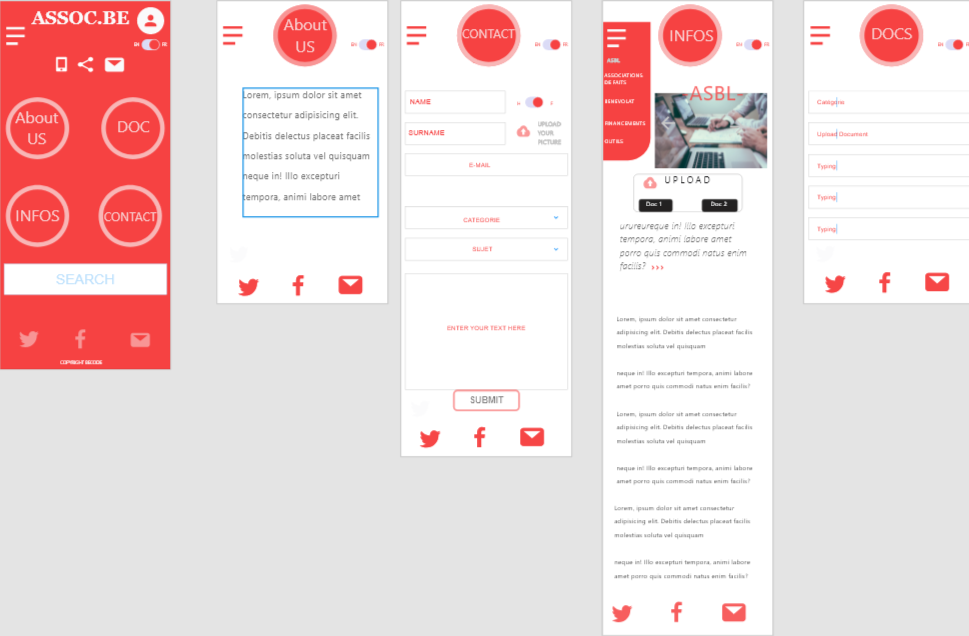

# multipage-website-in-php

## Lien des consignes
[https://github.com/becodeorg/Johnson2/tree/master/projets/multipage-website-in-php](https://github.com/becodeorg/Johnson2/tree/master/projets/multipage-website-in-php)

## Langages utilisés ?

+ HTML5, CSS3
+ Bootstrap 4
+ JavaScript
+ PHP, MySQL

## Réalisé par :

+ Paul Henrot [https://github.com/makemyA] (https://github.com/makemyA)
+ Jean-François Geerinckx [https://github.com/JFGEER83] (https://github.com/JFGEER83) 

## Réalisation :
 
 ### Jean-François Geerinckx :
 
 Nous avons décidé, au début du projet de nous partager les tâches en fonction de notre envie d'évoluer dans une partie que nous maitrisons moins si pas du tout. 
 De ce fait-là, je me suis occupé de la partie Php, ne me sentant pas à l'aise avec ce language, je voulais pouvoir combler mes lacunes et surtout améliorer ma compréhension à son sujet. 
 Ce fut assez laborieux les trois premiers jours, ne sachant pas vraiment ce que je fesais, tel un aveugle dans un labyrinthe de miroirs, passant mon temps à me cogner sans savoir vraiment pourquoi. Jusqu'à ce que, à force de test, de recherche, j'arrive enfin à un résultat. Je vois lentement le bout de la montagne, je retrouve la vue et surtout je sais tout doucement traduire ce language. 
 C'était une période de recherche et d'essais. 
 Après la finition du formulaire, la configuration de php mailer ('instalation de Composer, se perdre dans l'instalation d'autres fonctionnalitées de mail plus complexes...), et finalement l'arrivée d'un résultat qui me rendra plus qu'heureux (il n'y a pas de petits plaisirs). 
 
 #### Liste d'objectif réalisé :
 
 * groupe : Agile (manipulation tableau kanban) + tenue quotidienne du planning du groupe
   Nous avons décider d'utiliser un autre outil d'organistion style kanban qui se nomme Monday 
  (évidement cet outil était en  version d'essais, enfin c'est ce que j'ai hélas découvert une semaine plus tard...)    
  
 ![Exemple de notre kanban version Monday.com] (https://imgur.com/I30LazP) .
    
 ![Exemple de notre kanban version Monday.com] (https://imgur.com/4NEI1hB) . 
   
 * groupe : être le capitaine du repos, qui gère les merge et les conflits
 * groupe : rédaction d'un readme complet et professionnel 
 * backend : utilisation d'un serveur SMTP
 * backend : éviter les injections SQL
 * backend : édition d'un fichier txt en PHP
 * backend : upload d'image
 * devops : déploiement sur Heroku

### Paul Henrot :

Comme Jean-François l'a expliqué plus haut, nous avons décidé de partager les tâches pour ce travail en se donnant pour objectif de s'améliorer dans les domaines ou nous sentions moins à l'aise. 
Ayant déjà réalisé un formulaire avec envois de mail lors d'un ancien exercice, je me suis consacré entièrement au front end dans ce projet.

L'objectif que je me suis fixé était de recommencer totalement le site du client from "scratch" et en vanilla.
Tout le site est "cousu main" hormis pour l'ajout de la bibliothèque particles.js ainsi qu'un code Jquery permettant de naviguer dans le site de manière "smooth".

Il n'est pas fini, les yeux ont été plus gros que le ventre mais je trouve l'avancement du projet relativement positif. Surtout en si peu de temps (10 jours). Voici les différentes étapes suivies pour la partie front-end.

* Step1: Réalisation du mockup pour la version Mobile du site

Comme pour le code, je suis parti de zéro pour la réalisation du mockup. Je trouve l'exercice vraiment intéressant de tout réaliser soi même afin de constater les difficultés rencontrées dans le job de designer et intégrateur web. Voici les photos du projet initial:

* step2: Création du site en version mobile

Le site est réalisé sur un seul fichier html qui comprend des include PHP pour les différentes sections. 

Le défi de la partie mobile est de pensé le site en mode "application" étant donné qu'il s'agit d'une progressive Web App. La navigation dans les différentes sections se fait via le menu d'accueil directement.

* step3: Création du site en version Desktop

La plus grande difficulté était de différencier le code pour la version mobile de la version Desktop. 
Je dois absolument remettre de l'ordre dans mon code si je veux pouvoir l'utiliser pour d'autres réalisations.
Cela a été un enfer pour s'y retrouver vers la fin du projet.

Le site en Version Desktop se déploie comme un site traditionnel avec un grand header poussant l'utilisateur à directement cliquer sur une des sections ou le formulaire de contact.

* Avis final

J'ai adoré travailler avec mon Binôme Jean-François Geerinckx. Nous nous sommes directement mis d'accord sur les objectifs à réaliser. Nous nous sommes laissés assez d'espace pour pouvoir avancer chacun de notre coté mais tout en s'intéressant à l'autre pour l'aider en cas de problème. Nous nous sommes décidé à terminer complètement le projet dans les prochains jours afin de réellement valider celui-ci.
#### Liste d'objectif réalisé :

* frontend : Progressive Web App
* frontend : sélection et mise en place d'un framework CSS
* UX : branding
* groupe : rédaction d'un readme complet et professionnel
* frontend/backend : utiliser le lighthouse test pour améliorer son site et atteint un score de minimum 80 pour chaque critère.

## Résultat Lighthouse : 
 
 
 
## A venir

## Screenshots 

